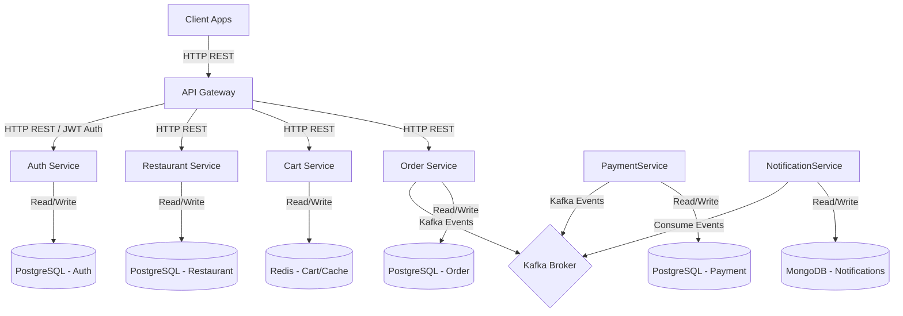

# Implementation Plan - Food Ordering Microservices Platform

This document outlines the architecture, service boundaries, database schemas, API contracts, events, and step-by-step implementation plan for the Food Ordering Microservices application, following the system workflow, skills, and rules.

---

## 1. System Architecture

We will implement a monorepo using **Nx Workspace** containing NestJS microservices and shared libraries.



### Key Components
1. **API Gateway (`api-gateway`)**: Entry point. Validates JWT, forwards requests to microservices, performs rate limiting.
2. **Auth Service (`auth-service`)**: Handles registration, login, and RBAC. Uses PostgreSQL.
3. **Restaurant Service (`restaurant-service`)**: Manages restaurants, menus, categories, and food items. Uses PostgreSQL and caches popular menus in Redis.
4. **Cart Service (`cart-service`)**: Manages shopping carts using Redis for high throughput.
5. **Order Service (`order-service`)**: Manages orders, tracks lifecycle, coordinates the Order Creation Saga. Uses PostgreSQL.
6. **Payment Service (`payment-service`)**: Simulates Stripe payments and manages transaction records. Uses PostgreSQL.
7. **Notification Service (`notification-service`)**: Consumes events to send notifications (email/SMS mockup). Logs notifications in MongoDB.

---

## 2. Technical Stack & Shared Libraries

### Technologies
- **Framework**: NestJS (v10+)
- **Monorepo Manager**: Nx
- **Databases**: PostgreSQL (Prisma ORM or TypeORM), MongoDB (Mongoose), Redis (ioredis)
- **Message Broker**: Apache Kafka
- **Containerization**: Docker Compose (Kafka, Postgres, MongoDB, Redis, Prometheus, Grafana, Loki)
- **Monitoring**: Prometheus, Grafana, Loki, Tempo (OpenTelemetry)

### Shared Library (`libs/common`)
To enforce consistency and avoid duplicated code, we will create a shared library `libs/common` containing:
- **DTOs**: Common request/response formats and pagination.
- **Exceptions**: Global exception handler, standard HTTP/RPC exceptions.
- **Interceptors**: Logging interceptor (structured JSON logs), response formatting.
- **Guards**: AuthGuard, RolesGuard.
- **Kafka**: Custom transporter helper, event contracts.
- **Health Checks**: Common health endpoints helper.

---

## 3. Database Design

Each service owns its database. There are no shared tables or cross-service joins.

### Auth DB (PostgreSQL)
- `users`: id (UUID), email (unique), password_hash, role (Enum: CUSTOMER, RESTAURANT_OWNER, ADMIN), created_at, updated_at
- `refresh_tokens`: id, user_id, token, expires_at, created_at

### Restaurant DB (PostgreSQL)
- `restaurants`: id (UUID), name, owner_id (UUID), address, phone, is_active, created_at, updated_at
- `categories`: id (UUID), restaurant_id, name, created_at
- `food_items`: id (UUID), category_id, name, description, price, is_available, created_at

### Cart DB (Redis Key-Value)
- Key: `cart:{userId}`
- Value (JSON):
  ```json
  {
    "restaurantId": "uuid",
    "items": [
      { "foodItemId": "uuid", "name": "Pizza", "price": 12.99, "quantity": 2 }
    ],
    "totalPrice": 25.98
  }
  ```

### Order DB (PostgreSQL)
- `orders`: id (UUID), user_id, restaurant_id, status (Enum: PENDING_PAYMENT, PAID, CANCELLED, CONFIRMED, COMPLETED), total_amount, created_at, updated_at
- `order_items`: id (UUID), order_id, food_item_id, name, price, quantity

### Payment DB (PostgreSQL)
- `payments`: id (UUID), order_id, transaction_id, amount, status (Enum: PENDING, SUCCESSFUL, FAILED, REFUNDED), provider (STRIPE), created_at, updated_at

### Notification DB (MongoDB)
- `notifications` collection: id, userId, orderId, type (EMAIL, SMS), content, status (SENT, FAILED), createdAt

---

## 4. API Design (Contracts)

All APIs return a standard format:
```json
{
  "success": true,
  "message": "Action completed successfully",
  "data": { ... },
  "timestamp": "2026-06-09T15:24:00Z"
}
```

### Key Endpoints

| Service | Method | Route | Auth / RBAC | Description |
| :--- | :--- | :--- | :--- | :--- |
| **Auth** | POST | `/api/v1/auth/register` | Public | Create customer/owner/admin account |
| **Auth** | POST | `/api/v1/auth/login` | Public | Authenticate and get JWT + Refresh token |
| **Auth** | POST | `/api/v1/auth/refresh` | Public | Refresh access token |
| **Restaurant** | POST | `/api/v1/restaurants` | RESTAURANT_OWNER | Create a restaurant |
| **Restaurant** | GET | `/api/v1/restaurants` | Public | List all active restaurants |
| **Restaurant** | POST | `/api/v1/restaurants/:id/categories`| OWNER | Create menu category |
| **Restaurant** | POST | `/api/v1/restaurants/:id/items` | OWNER | Create food item |
| **Restaurant** | GET | `/api/v1/restaurants/:id/menu` | Public | Get restaurant menu (cached) |
| **Cart** | POST | `/api/v1/cart` | CUSTOMER | Add/Update items in cart |
| **Cart** | GET | `/api/v1/cart` | CUSTOMER | View current cart |
| **Cart** | DELETE | `/api/v1/cart` | CUSTOMER | Clear cart |
| **Order** | POST | `/api/v1/orders` | CUSTOMER | Checkout cart and place order |
| **Order** | GET | `/api/v1/orders/:id` | CUSTOMER/OWNER | View order details |
| **Order** | POST | `/api/v1/orders/:id/cancel` | CUSTOMER | Cancel pending order |

---

## 5. Event-Driven Architecture & Saga Workflow

We use Kafka for async event processing. Events must be immutable and named using `PascalCase`.

### Events List
1. `OrderCreated`: Emitted when a customer places an order.
   - Payload: `{ orderId, userId, restaurantId, amount, items: [...] }`
2. `PaymentCompleted`: Emitted when payment succeeds.
   - Payload: `{ paymentId, orderId, transactionId, amount }`
3. `PaymentFailed`: Emitted when payment fails.
   - Payload: `{ orderId, amount, reason }`
4. `OrderConfirmed`: Emitted when payment is completed and order is confirmed.
   - Payload: `{ orderId, userId, restaurantId }`
5. `OrderCancelled`: Emitted as compensation if payment fails or order is manually cancelled.
   - Payload: `{ orderId, reason }`
6. `NotificationRequested`: Emitted to trigger email/SMS.
   - Payload: `{ userId, orderId, type, content }`

### Order Creation Saga Workflow
The Order Service acts as the Orchestrator for the Saga.

```
Order Service              Kafka               Payment Service       Notification Service
     |                       |                        |                       |
     |--- (Create Order) --->|                        |                       |
     |                       |                        |                       |
     |                       |--- OrderCreated ------>|                       |
     |                       |                        |-- (Stripe Pay)        |
     |                       |                        |                       |
     |                       |<-- PaymentCompleted ---|                       |
     |                       |   OR PaymentFailed     |                       |
     |                       |                        |                       |
     |<-- Consumes Event ----|                        |                       |
     |                       |                        |                       |
     |-- Confirm/Cancel ---->|                        |                       |
     |   Order in DB         |                        |                       |
     |                       |--- OrderConfirmed ---->|                       |
     |                       |   OR OrderCancelled    |                       |
     |                       |                        |                       |
     |                       |--- NotificationReq --------------------------->|
     |                       |                                                |-- Send & Log Notif
```

#### Compensation Logic:
If the `PaymentFailed` event is consumed by the Order Service:
1. Update order status in PostgreSQL to `CANCELLED`.
2. Emit `OrderCancelled` event.
3. Emit `NotificationRequested` event to notify the customer about the payment failure.

---

## 6. Implementation Steps

We will implement this in a structured, step-by-step manner.

### Step 1: Nx Workspace Setup
Initialize the Nx monorepo, install dependencies (NestJS, microservices, Kafka, databases client libraries).

### Step 2: Docker Compose Setup
Create a single `docker-compose.yml` for PostgreSQL, MongoDB, Redis, and Apache Kafka.

### Step 3: Shared Infrastructure Library (`libs/common`)
Implement common DTOs, custom exception filters, JSON structured logger, JWT Guards, and base configuration.

### Step 4: Auth Service & PostgreSQL Integration
Set up auth database, run migrations, implement register/login APIs, validate passwords, and issue JWT tokens.

### Step 5: Restaurant Service & Cache Implementation
Set up restaurant DB, Prisma/TypeORM schemas, implement menu management, and cache menus in Redis with a TTL of 10 minutes.

### Step 6: Cart Service & Redis Integration
Implement cart storage and operations in Redis under the `cart-service`.

### Step 7: Order Service & Saga Orchestration (Kafka Setup)
Create Order DB, implement Order placement, emit `OrderCreated` to Kafka.

### Step 8: Payment Service & Event Consumption
Consume `OrderCreated`, mock Stripe payment processing, emit `PaymentCompleted` or `PaymentFailed`.

### Step 9: Notification Service & MongoDB
Consume order/payment events, store logs in MongoDB, and mock email/SMS triggers.

### Step 10: Testing, Monitoring & Validation
Implement Unit, Integration, and E2E tests using Jest. Verify coverage (>80%). Set up `/health` and `/metrics` Prometheus configurations.

---

## 7. Next Actions

Let's begin by initializing the Nx Workspace. I will set up the Nx monorepo structure in the current workspace.
