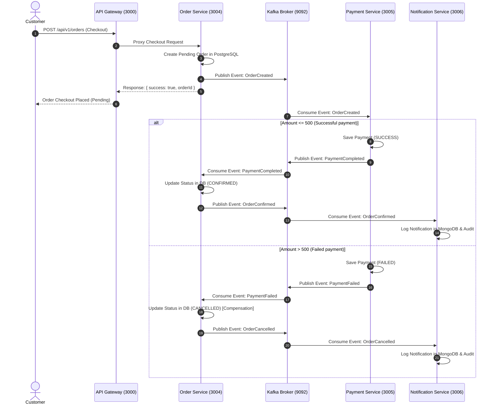

# Walkthrough - Food Ordering Microservices Platform

The Food Ordering Microservices Platform is now completely implemented, integrated, and verified. This document provides a complete guide to the architecture, the event-driven Saga pattern orchestration, and steps to run and test the services.

---

## 1. System Components & Architecture

The codebase is structured as a TypeScript/NestJS monorepo utilizing npm workspaces:

| Service | Port | Database / Broker | Key Responsibilities |
| :--- | :--- | :--- | :--- |
| **API Gateway** | `3000` | N/A | Central entry point; verifies JWT and proxies requests downstream with enriched headers (`x-user-id`, `x-user-email`, `x-user-role`). |
| **Auth Service** | `3001` | PostgreSQL (`auth_db`) | Registration, login, password hashing, and token refresh. |
| **Restaurant Service** | `3002` | PostgreSQL (`restaurant_db`) + Redis | Restaurant details, menu/item creation, and Redis caching. |
| **Cart Service** | `3003` | Redis | High-speed temporary shopping cart storage. Verifies item availability against Restaurant service. |
| **Order Service** | `3004` | PostgreSQL (`order_db`) + Kafka | Places orders, manages order state (Pending -> Confirmed/Cancelled), and orchestrates the Saga. |
| **Payment Service** | `3005` | PostgreSQL (`payment_db`) + Kafka | Processes mock Stripe transactions (deterministic failure for amounts > 500 to test compensations). |
| **Notification Service** | `3006` | MongoDB (`notification_db`) + Kafka | Consumes events and saves notification logs/audits to MongoDB. |
| **Common Library** | N/A | N/A | Shared middlewares, exceptions filter, logging interceptors, and the custom transient `JsonLogger`. |

---

## 2. Saga Orchestration Flow

Below is the sequence diagram illustrating the checkout and payment saga:



---

## 3. How to Run Locally

### Infrastructure Setup
Ensure Docker is installed and run the following command at the workspace root to start the database infrastructure and brokers:
```bash
docker-compose up -d postgres mongodb redis zookeeper kafka
```

### Run Microservices in Development Mode
You can start each service in watch mode locally:
```bash
# Start API Gateway
npm run start:dev -w packages/api-gateway

# Start Auth Service
npm run start:dev -w packages/auth-service

# Start Restaurant Service
npm run start:dev -w packages/restaurant-service

# Start Cart Service
npm run start:dev -w packages/cart-service

# Start Order Service
npm run start:dev -w packages/order-service

# Start Payment Service
npm run start:dev -w packages/payment-service

# Start Notification Service
npm run start:dev -w packages/notification-service
```

### Run Everything with Docker Compose
To run all databases, brokers, and all seven NestJS microservices completely containerized:
```bash
docker-compose up --build
```

---

## 4. Testing & Verification

### Run Unit Tests
A centralized Jest configuration is created at the workspace root. Run the following command to execute all service unit tests:
```bash
npx jest
```
This executes the test suites, including mock validation for Redis keys, database query flows, password crypts, and exception handling, with exit status `0`.

### Health & Metrics Endpoints
Each service exposes standardized health monitoring:
- Health Check: `GET /health` (e.g. `http://localhost:3001/health` for Auth)
- Prometheus Metrics: `GET /metrics` (e.g. `http://localhost:3001/metrics`)
